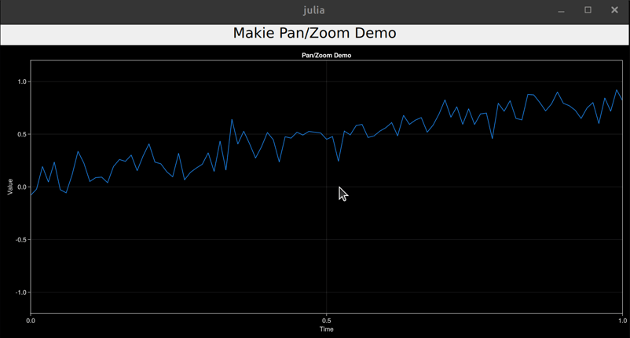

# QmlJuliaExamples

These are examples for use with the [QML.jl](https://github.com/JuliaGraphics/QML.jl) package. To run them, clone this repository and `cd ` to one of its subdirectories. Then run `julia --project` and [instantiate the environment](https://pkgdocs.julialang.org/v1/environments/#Using-someone-else's-project).

Quickstart to test, from within Julia:

```julia
# Alternatively, execute the git command directly in the shell or download the zip file
import LibGit2
isdir("QmlJuliaExamples") || LibGit2.clone("https://github.com/barche/QmlJuliaExamples.git", "QmlJuliaExamples")
cd("QmlJuliaExamples/basic") # or images, opengl or plots instead of the basic subdirectory

# As an alternative to next three lines,
# 1) Start Julia with `julia --project`
# 2) Run `instantiate` from the pkg shell.
using Pkg
Pkg.activate(".")
Pkg.instantiate()

readdir() # Print list of example files
include("gui.jl") # Or any of the files in the directory
```
Most of the examples consist of a Julia script and a .qml file in the qml subfolder.

The qml file defines how the GUI looks, the Julia script provides one or more functions
for the business logic.

### Notes
- `Makie v0.17.13` is required for plots using that library.

### Basic examples
- board  OK
- canvas OK
- canvas_alpha OK
- canvas_twice OK
- checkboxes OK
- colors OK
- drag OK
- dynamiclist OK
- filedialog OK
- fizzbuzz OK
- grid OK 
- gui OK
- listmodel-fromjulia OK
- observable OK
- progressbar OK
- sketch OK
- tableview OK
- text OK

### Images (examples)
- image OK
- threadedcanvas  
  Not doing anything.
- treadeddisplay  
  Not doing anything.

### OpenGL examples
- gltriangle OK
- makie-plot PERFECT
- makie GOOD
- makie-panzoom OK
   

### Plots (examples)
- canvas_and_gr Very nice
- gr OK
- plot OK
- repl-background 
  Not doing anything.